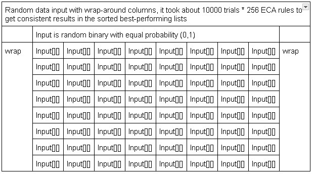
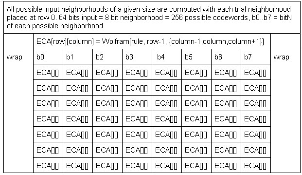
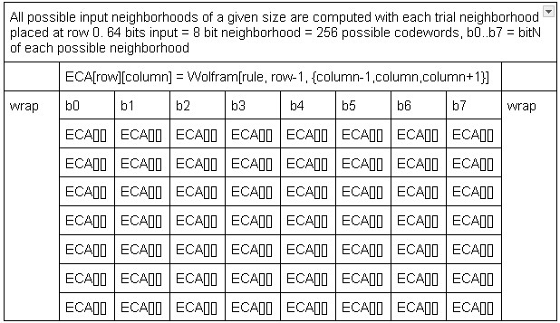
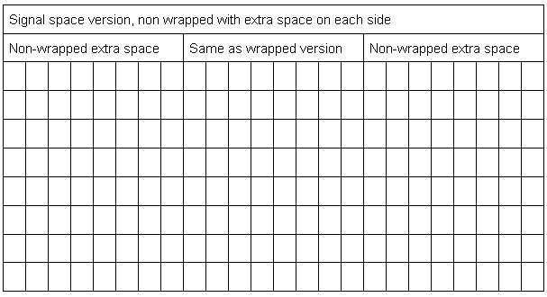

Elementary Cellular Automata as a Signal Hash Algorithm\
Daniel McKinley\
November 19, 2024

Elementary cellular automata are extensions of logic gate truth tables done linearly in parallel [ANKOS, 2002]. Here they are explored as a file hash and signal hash algorithm, minimizing discrepancies between the input and output data by choosing the correct row 0 input neighborhood for a given 0-255 ECA rule. Unique solutions and best performing elementary automata rules are identified and several parameters are explored for effect on behavior. It is implemented in Java at github.com/dmcki23/Stirling.

ECA image here

The algorithm has 3 properties of a good hash algorithm, and 2 that make it more suitable as a signal hash rather than a block data hash [some hash paper citation]. Each input has a unique solution, the solutions are distributed evenly across all possible solutions, and it loses less than half the bits per compression cycle. Small changes to the input do not produce large changes in the solution, and errors in compression are semi uneven which is mitigated in context of a signal.

Unique Minimums\
Certain ECA rules reduce to unique solutions for any given input. Another overlapping set reduces to a unique solution when the errorScore is calculated with an exponent of 4 instead of 2.\

Even Distribution of solutions\
All possible solutions for any given rule have an equal probability of occuring over enough iterations of random input.\

Better than 50% accuracy\
Certain ECA rules, including a large overlap with the XOR additive rules [citation] have better than 2/3 accuracy/bit with most rules having better than 1/2 accuracy/bit over all the input bits. The wrapped/non-wrapped tradeoff is 2/3 accuracy and an uneven errors/row when done repeatedly or 1/2 accuracy and linear errors/frequency. In the non-wrapped signal version the best performing rules had better than 1/2 accuracy/bit.\

Error distribution\
Errors are distributed equally across columns, and with the errors in the last row roughly half that of the first row. In the context of a signal you would have a tendency to linearly lose more in either the high or low frequencies. \

Hamming changes solution per hamming changes input\
If you change the input of a given (input, solution) and score the difference the same way you score the error that gets minimized, the mean changeScore per Hamming change in the codeword is roughly 100, corresponding to a one bit difference at any column between row 6 and row 7 where 2^row = changeScore/bit.\

Wrapped v non-wrapped output space\
The block data version uses a wrap around cylindrical calculation output space, and the signal version does not wrap around and has space on either side of the input neighborhood, representing a window on a signal. TODO cross-refence algorithm with codewords of Hamming(7,4).\

Ideal ECA 60,90\
Results are checked for all neighborhoods with stochastic input, roughly 10000 are required for consistent results in some categories. Rules 90,60,102,153 are the best performing rules in terms of accuracy with several class 4 rules performing almost as well as the Pascal triangle set. When the error scoring exponent is changed to 4 instead of 2, several more members of the XOR additive rules perform well.

Class 4 Rules\
Several class 4 ECA rules perform well in the hash algorithm, indicating that in future iterations of the project some types of data and some types of noise affect the ideal ECA hash for a given situation beyond what is presented here.

References\

ANKOS, 2002\
Some hash paper research