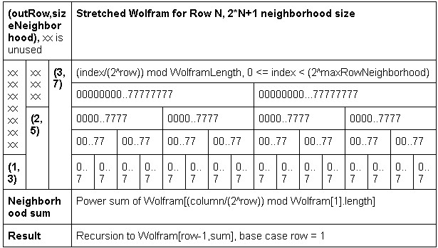

Elementary Cellular Automata Center Column Equalitities
Daniel McKinley
November 19, 2024

Elementary cellular automata are extensions of logic gate truth tables done linearly iteratively in  parallel [ANKOS, 2002]. Any given center column of an input neighborhood surrounded by zeros has multiple alternate input neighborhoods of larger sizes producing the same center column with a predictable phase offset. The brute force method of attempting all possible neighborhoods for equivalent center columns is trimmed to ??? via Wolfram code extensions beyond row 1. Output for this algorithm is tested via brute force and several kinds of behavior for various classes of rules are explored. The algorithm is applied to Wolfram's prime number cellular automata [Stephen Wolfram PrimeCA citation].

Algorithm implementation outline\
Some kind of images\
\

Speedup
Phase shift
Spot numbering
primeCA

References
A New Kind of Science, 2002
